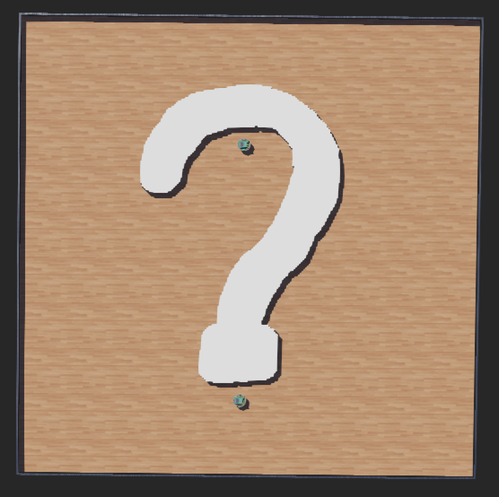
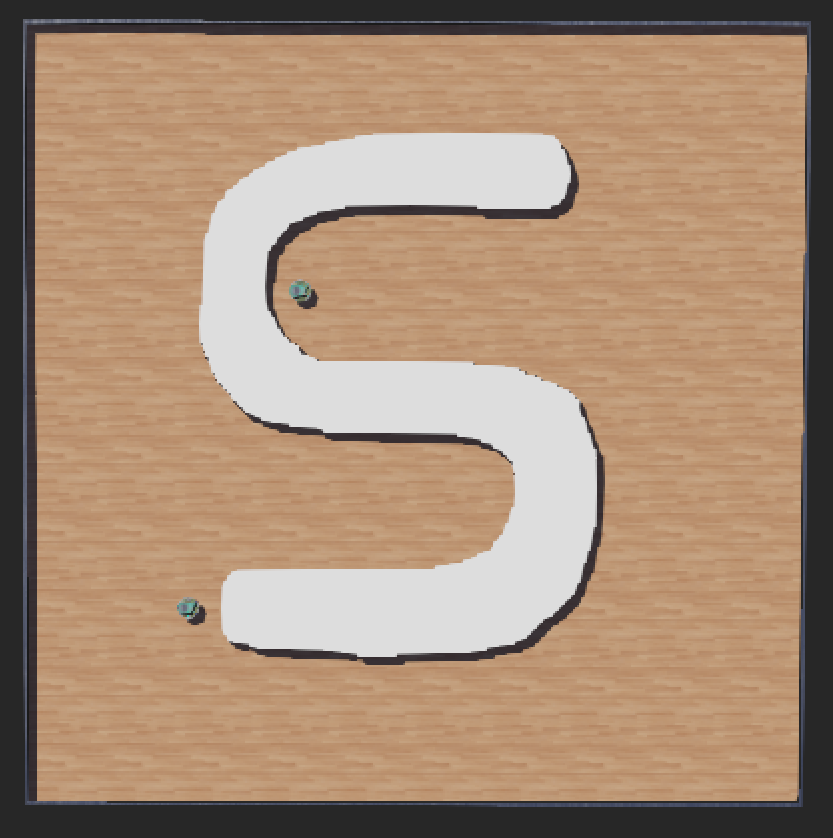
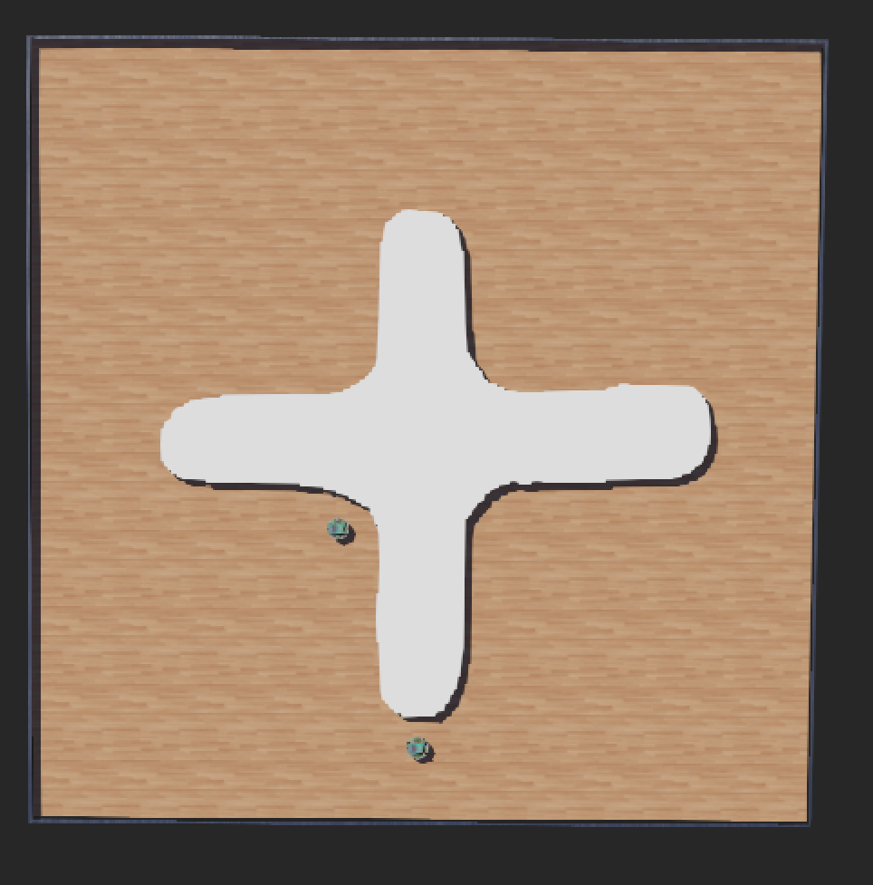
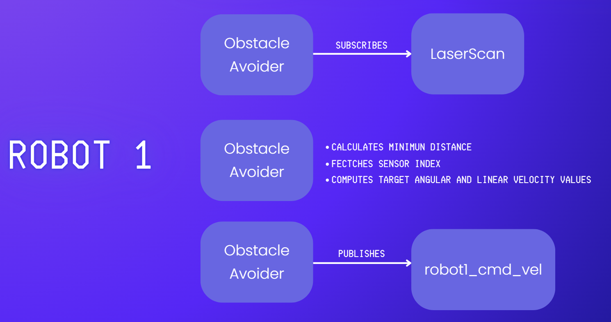
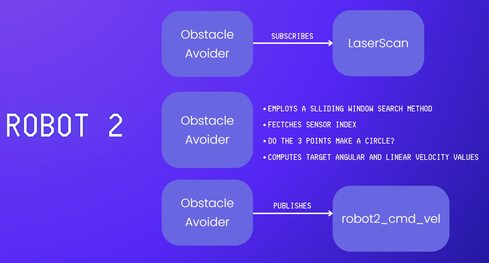
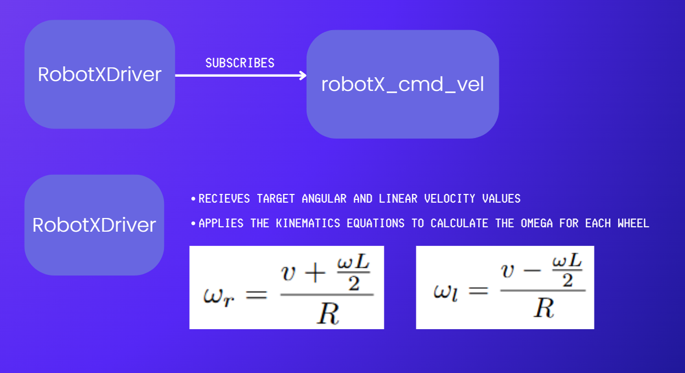
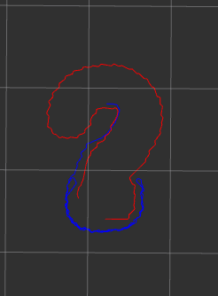
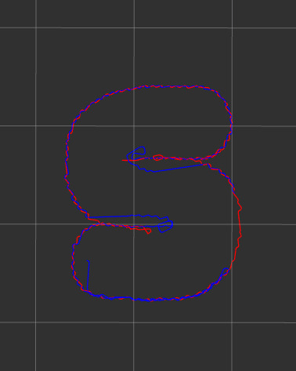
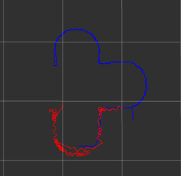

# Reactive-Robots
Assignment of the course Topics in Intelligent Robotics (Master Degree in Artificial Intelligence 1st year, 2nd semester) at University of Porto (FCUP/FEUP).

## A little context
### Overview
The aim of this project was to develop two reactive robots, operating purely on real-time sensor data with no memory, capable of navigating through unknown environments. The primary tasks consist of implementing a wall-following behavior for the first robot (Robot 1) and a combined wall-following/robot-following behavior for the second robot (Robot 2). The system was developed using ROS 2 (alongside RViz for visualization) to control the logic, and Webots as the simulation environment.

### The System's characteristics
#### Action Space
Actions consist of target linear and angular velocities (`cmd_vel`). These are sent to the robots' drivers, which apply kinematics equations to calculate the specific angular velocity for the left and right wheel motors:

$$\omega_{r}=\frac{v+\frac{\omega L}{2}}{R} \quad \text{and} \quad \omega_{l}=\frac{v-\frac{\omega L}{2}}{R}$$

#### Navigation Behaviors
* **Wall-Following / Obstacle Avoidance:** The robots analyze LIDAR arrays to find the minimum distance to obstacles. Depending on the sensor index, the robot computes an angular velocity to turn away and align with the wall.
* **Robot-Following (Robot 2):** Employs a sliding window search method on the sensor data to detect patterns (e.g., checking if 3 points make a circle) to identify the other robot. A proportional controller ($K_p$) is then used to adjust the turning speed to face and follow the target.
#### Architecture
The architecture isolates the decision-making nodes (`obstacle_avoider`) from the hardware-actuation nodes (`robot_driver`). The avoiders subscribe to `LaserScan` data and publish to `cmd_vel`, while the drivers subscribe to `cmd_vel` and apply the kinematics formulas.
#### Percepts (Observations)
Observations rely entirely on real-time sensors:
* **LIDAR:** Used for distance measuring, obstacle detection, and robot tracking.
* **GPS:** Used by the drivers and supervisors to extract positional data for logging and visualizing the robots' paths via RViz markers and Webots `IndexedLineSet`.

### Simulation Environments
The robots were tested in three distinct maps to evaluate efficiency, robustness, and limitations of a memory-less architecture.

  
  
  

### Sensor Data Processing & Architecture

  
  
  

### Path Visualization & Experimental Results
During execution, the robots' trajectories and velocity profiles are continuously monitored. The `robot_path_visualizer` dynamically draws the path of Robot 2 in Webots, while RViz Markers track the historical positions of the agents. Furthermore, the drivers log the linear velocity, angular velocity, and individual wheel speeds to CSV files for post-analysis.

  
  
  

### Conclusion

The project successfully demonstrated that complex navigation tasks, such as wall-following and entity-tracking, can be achieved using purely reactive architectures without the need for mapping or memory. By relying entirely on real-time LIDAR data and proportional control algorithms, Robot 1 maintained a safe distance from obstacles, while Robot 2 dynamically switched between avoiding walls and pursuing the leader.

The kinematics decoupling—where drivers translate high-level `cmd_vel` instructions into precise wheel velocities—proved to be an effective and modular design choice in ROS 2. However, testing in the Robustness Environment highlighted the intrinsic limitations of memory-less systems. In highly complex or concave obstacle scenarios, purely reactive robots are susceptible to getting stuck in local minima or oscillating between conflicting behaviors (e.g., following the robot vs. avoiding an immediate wall). 

Despite these limitations, the implemented sliding window search method for entity recognition and the real-time visualization tools (RViz and Webots path tracking) provided a robust framework for evaluating the swarm-like behaviors. Future improvements could involve fine-tuning the proportional gain factors for smoother turning, implementing temporary short-term memory to escape local minima, or adding basic state-machines to manage the transitions between wall-following and robot-following more elegantly.

## Main Files
- **obstacle_avoider.py**: ROS 2 node for Robot 1. Subscribes to LIDAR data and publishes movement commands to follow walls and avoid collisions.
- **obstacle_robot_avoider.py**: ROS 2 node for Robot 2. Contains dual logic to avoid walls and follow Robot 1 using a proportional controller based on LIDAR target detection.
- **robot1_driver.py**: Driver node for Robot 1. Translates `cmd_vel` into wheel motor velocities using kinematics, publishes GPS path markers to RViz, and logs velocity data.
- **robot2_driver.py**: Driver node for Robot 2. Similar to Robot 1's driver, tailored for the second agent's namespaces and topics.
- **robot_path_visualizer.py**: Webots Supervisor script that subscribes to the robot's GPS position and dynamically draws its trajectory using an `IndexedLineSet`.
- **robot1_log_data.csv**: Execution logs for Robot 1 containing timestamps, linear/angular velocities, and individual wheel speeds.
- **robot2_log_data.csv**: Execution logs for Robot 2 containing timestamps, linear/angular velocities, and individual wheel speeds.
